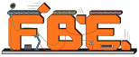

# factorio-blueprint-editor

_All badges are clickable!_

A feature-rich [Factorio](https://www.factorio.com) Blueprint Editor. You can now edit your blueprints in the browser!

Sample blueprint: https://teoxoy.github.io/factorio-blueprint-editor/?source=https://pastebin.com/uc4n81GP

Example link that uses url query parameters: https://teoxoy.github.io/factorio-blueprint-editor/?source=https://pastebin.com/Xp9u7NaA&index=1&renderOnly

# Contributing

Check out [this readme](./CONTRIBUTING.md) if you are interested in contributing.

# Credits

Thanks to all contributors!

Thanks to everyone who submitted bugs and feature requests on github and doorbell.io!

Thanks to the factorio player GamesDan for reporting a lot of issues via doorbell!
