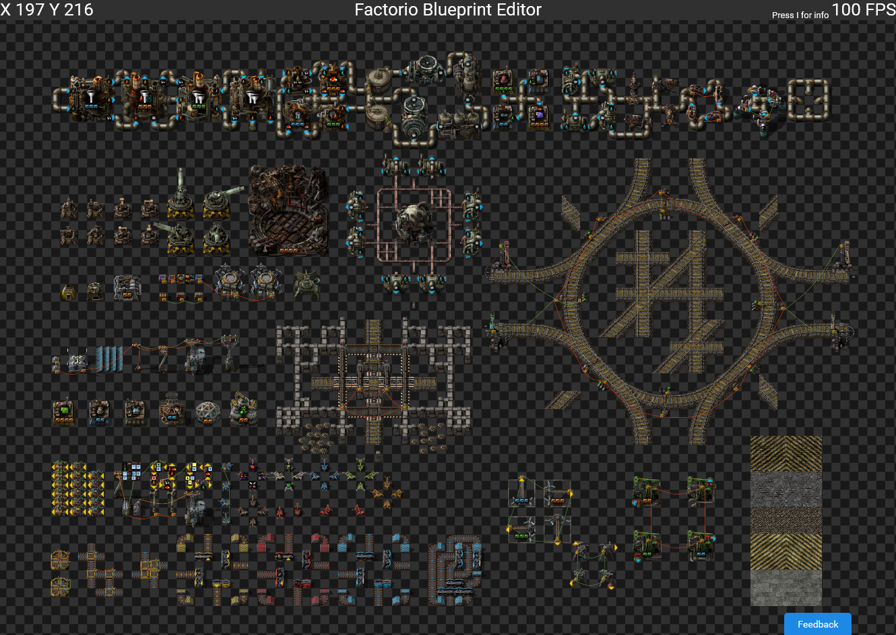

 
 
 

# factorio-blueprint-editor

A [Factorio](https://www.factorio.com) blueprint editor and renderer webapp

You can find the working website here: https://teoxoy.github.io/factorio-blueprint-editor

Sample blueprint: https://teoxoy.github.io/factorio-blueprint-editor/?source=https://pastebin.com/uc4n81GP

Example link that uses url query parameters: https://teoxoy.github.io/factorio-blueprint-editor/?source=https://pastebin.com/Xp9u7NaA&index=1

# Contributing

Feel free to contribute to this project, if you have any questions you can contact me on discord (Teoxoy#6734).

# TODO:
- implement more entity settings (filters, conditions)
- edit bp label and icons
- pipe window
- implement the other cursorBoxes
- overlay for turrets
- show electricity-icon-unplugged for entities that are not connected to a power pole
- bp manager (manage bps and books in an editor + placement of new blueprint in an allready loaded bp)
- show bp inputs (show icons for belts)
- throughput calculator/bp analyzer/bottleneck detector
- highlight lone underground pipes/belts
- train-stop station name
- poles range, wires and rotations
- rotate bp
- implement circuit_wire_max_distance with visualization ((x - center_x)^2 + (y - center_y)^2 <= radius^2)
- rail endings
- rail custom bounding box
- rail rotations
- belt endings
- tile edges
- tile history
